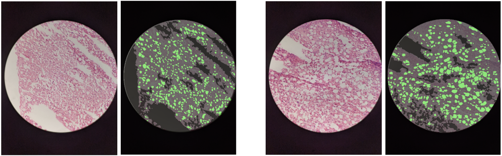

# Liver Segmentation

Automated segmentation and estimation of liver steatosis in frozen or formalin-preserved sections using smartphone-based images.



## Install conda

Before you run the script, you will need to have `conda` installed. The instructions to install `conda` for your operating system [can be found here](https://docs.conda.io/projects/conda/en/latest/user-guide/install/index.html#regular-installation).

## Usage

To run the script, open the command line. Navigate to the directory with both the bash script and Python script. Then, run the following line in the command line.

```bash
source liver_segmentation.sh
```

Once the necessary dependencies are installed, you will be prompted for the following information:

```
Enter the relative path to the directory with liver biopsy images:

Enter the relative path to the directory to save output:

Enter the magnification of the images ('10x', '20x', or '40x'):

Enter the biopsy preservation type ('frozen' or 'formalin'): 

[OPTIONAL] Enter the relative path to a CSV file with pathologist fat estimates for comparison (press "Enter" to leave blank):
```

Alternatively, you can set your values directly in `config.file` and run the script with the following command:

```bash
source liver_segmentation.sh use_config
```

The default configuration in `config.file` will process the sample images in the `frozen_samples` directory.

## Example

Below is an example directory containing the liver biopsy images (`formalin_images`, an empty directory in which to save output (`formalin_output`), and the `liver_segmentation.sh` script.

```
.
├── formalin_images (directory with liver biopsy images)
│   ├── HF-1 (subdirectory names are liver names)
│   │   ├── HF-1 formalin - 3hr - 20x - a - 1.tiff (image name)
│   │   ├── HF-1 formalin - 3hr - 20x - b - 1.tiff
│   │   └── ...
│   ├── HF-2
│   ├── HF-3
│   └── ...
├── formalin_output (directory to save output)
├── liver_segmentation.sh
```

* The directory with liver biopsy images should contain subdirectories named as only liver names. The names of images in the subdirectories should include the magnification of the image. The magnification should be written in the format of `20x`.

* The directory to save output should be empty before you run the script. If it does not exist, it will be created. This directory will save the segmented liver images and the fat estimates.

* If you are including a CSV file of pathologist estimates for comparison, each row should begin with the liver name and be followed by any pathologist estimates:

```
HF-1,25,20
HF-2,0,10
HF-3,40,25
```

* The magnification of the images to use should be written as `20x` and should match the magnification written in the image names. Although `10x` magnification is supported, for best results, either `20x` or `40x` should be used.

The following is an example response to the prompts above.

```
Enter the relative path to the directory with liver biopsy images:
formalin_images

Enter the relative path to the directory to save output:
formalin_output

Enter the magnification of the images ('10x', '20x', or '40x'):
20x

Enter the biopsy preservation type ('frozen' or 'formalin'): 
frozen

[OPTIONAL] Enter the relative path to a CSV file with pathologist fat estimates for comparison (press "Enter" to leave blank):
/path/to/pathologist_estimates_macro.csv
```

## License
[MIT](https://choosealicense.com/licenses/mit/)